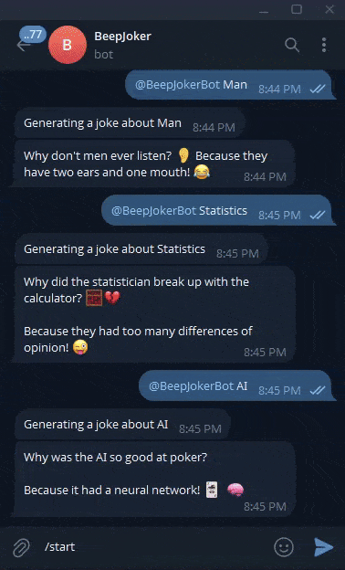

# 🤖 BeepJokerBot – Your AI-Powered Telegram Joke Bot

**BeepJokerBot** is a fun, AI-powered Telegram bot that delivers a single hilarious joke (with emojis!) based on any topic you mention. Just tag the bot in a message like `@BeepJokerBot cats`, and it’ll do the rest.

Built with:

* 🧠 [LangChain](https://www.langchain.com/)
* ⚡ [Groq API](https://groq.com/)
* 🤖 [Gemma2-9b-It](https://www.groq.com/models)
* 💬 Telegram Bot API

---

## 🎬 Demo



---

## ✨ Features

* 🎯 Mention-based joke generation
* 🧠 Uses large language model (`Gemma2-9b-It`) for creativity
* 😂 Returns a *single* funny joke per request
* 🤖 Deployed with `python-telegram-bot`
* 💡 Great for groups or personal entertainment

---

## 🚀 Getting Started

### 1. Clone the Repo

```bash
git clone https://github.com/abdullahakintobi/beepjoker.git
cd beepjoker
```

### 2. Install Dependencies

```bash
pip install -r requirements.txt
```

### 3. Set Up Environment Variables

Create a `.env` file in the root directory:

```env
TELEGRAM_API_KEY=your_telegram_bot_token
GROQ_API_KEY=your_groq_api_key
LANGCHAIN_API_KEY=your_langchain_api_key
LANGCHAIN_PROJECT=your_langchain_project
```

---

## 📂 Repository Structure

```
.
├── LICENSE              # License file
├── Procfile             # For deployment (e.g., Heroku)
├── README.md            # This file
├── bot.py               # Main bot logic
├── demo.gif             # Demo of bot interaction
├── requirements.txt     # Python dependencies
└── .env                 # Not committed – your API secrets
```

---

## 🛠 How It Works

* Listens for messages mentioning `@BeepJokerBot`.
* Extracts the topic from the message using regex.
* Sends the topic to a LangChain pipeline.
* Returns a funny, emoji-rich joke to the user.

---

## ⚙️ Running the Bot Locally

```bash
python bot.py
```

Or deploy it to platforms like **Heroku** using the included `Procfile`.

---

## 🧩 Technologies Used

* Python
* Telegram Bot API
* LangChain
* Groq (Gemma2-9b-It)
* python-telegram-bot
* dotenv

---

## 📄 License

This project is licensed under the [Apache-2.0 license](LICENSE).

---

## 💬 Contact & Contributions

Found a bug or want to suggest a feature? Open an issue or create a pull request.
